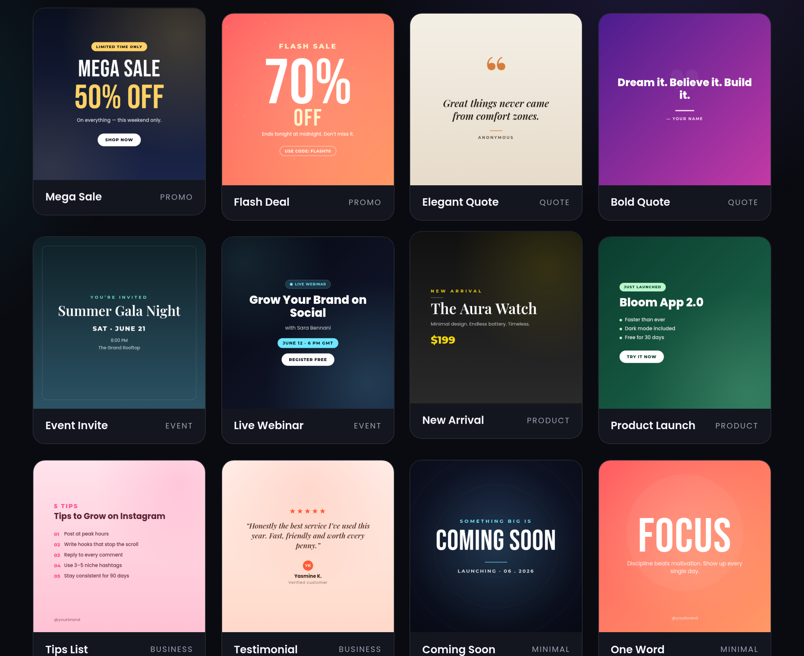

# POSTCRAFT — Social Media Template Studio

A pack of **12 fully-editable social media post templates** in a single web
app. Pick a design, change the text, switch the color theme and the post size,
then **download a crisp PNG** — all in the browser. No design skills, no
Photoshop, no sign-up.

**Live demo:** start a tiny web server in this folder and open it (see *Run* below).



---

## What's inside

- **12 templates** across 6 categories — Promo, Quote, Event, Product,
  Business, Minimal.
- **10 color themes** — switch any template between Midnight, Sunset, Grape,
  Ocean, Forest, Mono, Electric, Cream, Blush, Coral with one click.
- **3 export sizes** — Square 1:1 (feed), Portrait 4:5 (max reach),
  Story 9:16 (Stories / Reels).
- **Live editing** — every line of text is editable; the preview updates as you type.
- **Instant PNG export** — standard or **HD (2×)** for ultra-crisp results.
- **100% client-side** — every post is *drawn on a `<canvas>`*. No image
  assets, no libraries, no build step, no backend.
- **Fully responsive** studio UI, works on mobile.

The 12 templates: Mega Sale · Flash Deal · Elegant Quote · Bold Quote ·
Event Invite · Live Webinar · New Arrival · Product Launch · Tips List ·
Testimonial · Coming Soon · One Word.

---

## Run

It uses ES modules, so it must be served over HTTP (opening `index.html`
directly via `file://` won't load the modules).

```bash
# from inside this folder:
python3 -m http.server 8080
# then open http://localhost:8080
```

Or use any static server (`npx serve`, VS Code "Live Server", etc.).

---

## One file controls everything — `config.js`

All copy, the template list, color themes, export sizes and pricing live in
`config.js`. Re-skinning the whole studio for a client is just editing data.

```js
export const CONFIG = {
  brand:   { name: 'POSTCRAFT', orderUrl: 'https://fiverr.com/your-gig', ... },
  hero:    { title: '...', stats: [...] },
  palettes:{ midnight: { bg:'#0b1020', bg2:'#1b2548', fg:'#fff', accent:'#ffd166' }, ... },
  templates: [
    { id:'mega-sale', name:'Mega Sale', category:'Promo', kind:'megaSale',
      palette:'midnight',
      fields:[ { key:'headline', label:'Headline', type:'text', value:'MEGA SALE' }, ... ] },
    ...
  ],
  pricing: { tiers: [ ... ] },   // your Fiverr packages
};
```

### Make it yours in 2 minutes
1. Open `config.js`.
2. Set `brand.orderUrl` to **your Fiverr gig link** and `brand.email`.
3. Edit the `pricing.tiers` to match your packages.
4. (Optional) Tweak palettes or default template text. Refresh. Done.

### Add a brand-new template
1. Add an object to `templates[]` with a new `kind` and its editable `fields`.
2. Open `script.js`, write a `kind(ctx, W, H, d, p)` drawing function and add it
   to the `DRAWERS` map. `d` = your field values, `p` = the active palette.
   Helpers are provided (`textBlock`, `pillC`, `fillV`, `glow`, `rr`, …).

---

## Tech

- **Vanilla HTML + CSS + ES modules.** No framework, no `npm install`.
- Posts are rendered with the **Canvas 2D API** and exported via `canvas.toBlob`.
- **Google Fonts** — Bebas Neue, Poppins, Montserrat, Playfair Display.

---

## Deploy

Drop the folder onto any static host:

- **Netlify** — drag & drop the directory
- **Vercel** — `vercel deploy`
- **GitHub Pages** — push and enable Pages
- **Any static host** — upload `index.html`, `styles.css`, `script.js`, `config.js`

---

## Selling this on Fiverr — suggested packages

These are pre-filled in `config.js` (`pricing.tiers`). Edit the prices to taste.

| Tier | What's included |
|------|-----------------|
| **Basic — $15** | 5 custom posts from any template · your text, colors & logo · 1 size (square) · PNG delivery · 2-day delivery |
| **Standard — $35** | 12 custom posts · all 3 sizes (post / portrait / story) · custom color theme matching your brand · HD export · the editable studio included · 3-day delivery |
| **Premium — $75** | 30 custom posts · custom templates designed for you · full editable studio + your fonts · content calendar (captions + hashtags) · unlimited revisions · 5-day delivery |

**Gig title ideas:** *"I will create 12 editable social media post templates"* ·
*"I will design a branded social media post pack with an editor"*.

> Tip: record a 30-second screen capture of the studio (pick → edit → download)
> as your Fiverr gig video. It converts far better than static mock-ups.
